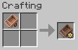
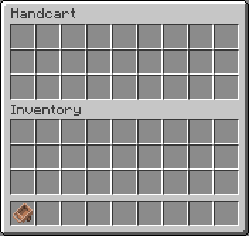

# RxHandcart

A Minecraft mod to add a handcart.

RxHandcartはMinecraftの世界にHandcart（荷車）を追加するmodです。

## Download

- [v1.19-0.1.2.0](https://github.com/Iunius118/RxHandcart/releases/download/v1.19-0.1.2.0/RxHandcart-1.19-0.1.2.0.jar) for Minecraft 1.19, Forge 1.19-41.0.45+
- [v1.18.1-0.1.0.2](https://github.com/Iunius118/RxHandcart/releases/download/v1.18.1-0.1.0.2/RxHandcart-1.18.1-0.1.0.2.jar) for Minecraft 1.18.1, Forge 1.18.1-39.1.0+
- [v1.17.1-0.1.0.1](https://github.com/Iunius118/RxHandcart/releases/download/v1.17.1-0.1.0.1/RxHandcart-1.17.1-0.1.0.1.jar) for Minecraft 1.17.1, Forge 1.17.1-37.1.1+
- [v1.16.5-0.1.0.0](https://github.com/Iunius118/RxHandcart/releases/download/v1.16.5-0.1.0.0/RxHandcart-1.16.5-0.1.0.0.jar) for Minecraft 1.16.5, Forge 1.16.5-36.2.34+

## Description

### Items

#### Handcart (荷車)

Item ID: `rxhandcart:handcart`

- プレイヤーが手に持って使用すると荷車インベントリ（Handcart Inventory）を開くことができます

#### Switching Visibility of Handcart (荷車の表示切替)

Item ID: `rxhandcart:handcart_setting`

- プレイヤーが手に持って使用するたびにそのプレイヤーの荷車の表示と非表示を切り替えます
- 初期状態では各プレイヤーの荷車は非表示になっています
- 荷車が非表示の状態でもHandcartアイテムを使用して荷車インベントリを開くことはできます

### Handcart Inventory (荷車インベントリ)

- 荷車インベントリはこのmodで追加される27スロットのインベントリです
- それぞれのプレイヤーは自分専用の荷車インベントリを1つだけ持ち、各荷車インベントリはその所有者のみがアクセスできます
- 荷車インベントリに入れられたアイテムはその所有者であるプレイヤー自身に保存され、そのプレイヤーが死亡しても荷車インベントリ内のアイテムは失われません

----
© 2021 Iunius118
