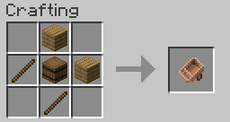

# RxHandcart

A Minecraft mod to add a handcart.

RxHandcartはMinecraftの世界にHandcart（荷車）を追加するmodです。

## Download

- [Releases](https://github.com/Iunius118/RxHandcart/releases)

## Description

### Requirements

- Minecraft 1.17.1
  - Minecraft Forge 1.17.1-37.1.1+
- Minecraft 1.16.5
  - Minecraft Forge 1.16.5-36.2.20+

### Items

#### Handcart (荷車)

Item ID: `rxhandcart:handcart`

- プレイヤーが手に持って使用するとHandcart（荷車）インベントリを開くことができます

#### Switching Visibility of Handcart (荷車の表示切替)

Item ID: `rxhandcart:handcart_setting`

- プレイヤーが手に持って使用するたびにそのプレイヤーの荷車の表示と非表示を切り替えます
- 初期状態では各プレイヤーの荷車は非表示になっています
- 荷車が非表示の状態でもHandcartアイテムを使用してHandcartインベントリを開くことはできます

### Handcart Inventory (荷車インベントリ)

- Handcartインベントリはこのmodで追加される27スロットのインベントリです
- それぞれのプレイヤーは自分専用のHandcartインベントリを1つだけ持ち、各Handcartインベントリはその所有者のみがアクセスできます
- Handcartインベントリに入れられたアイテムはその所有者であるプレイヤー自身に保存され、そのプレイヤーが死亡してもHandcartインベントリ内のアイテムは失われません

----
© 2021 Iunius118
